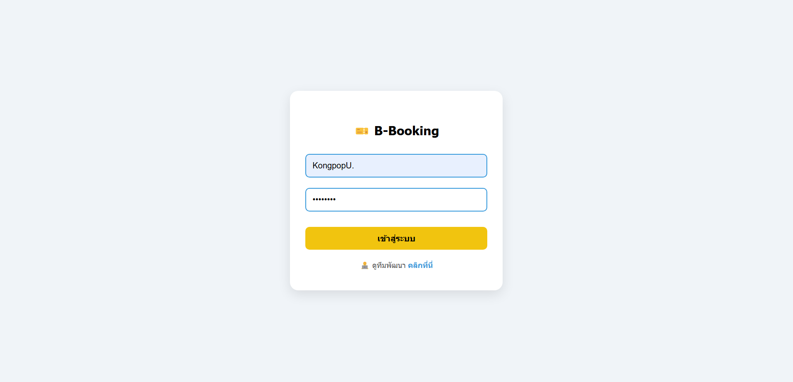
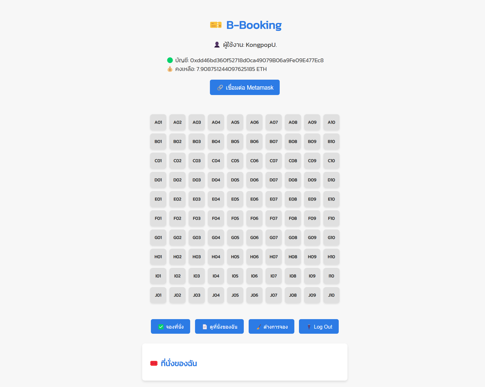
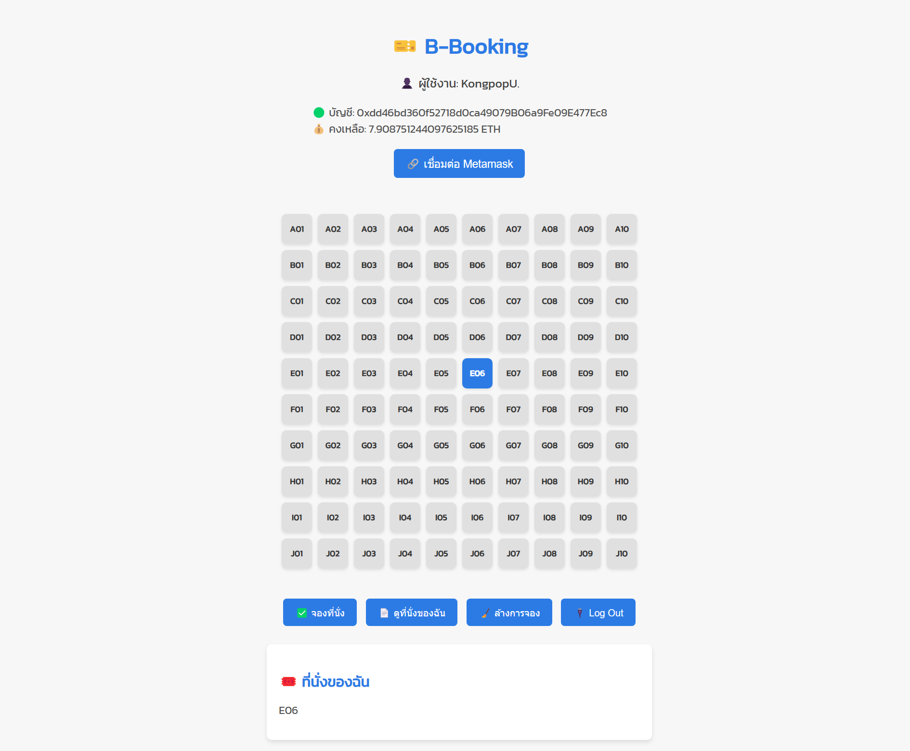
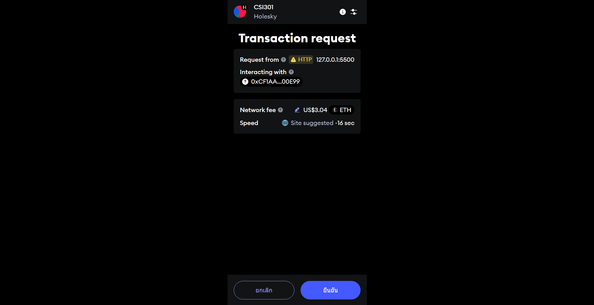
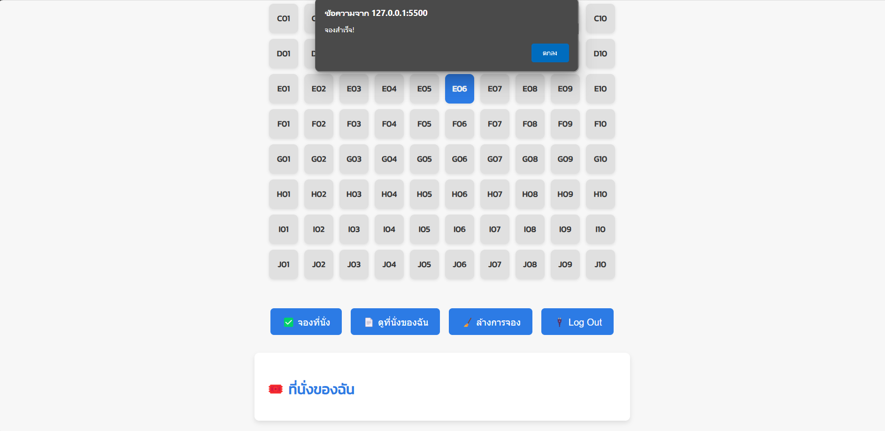
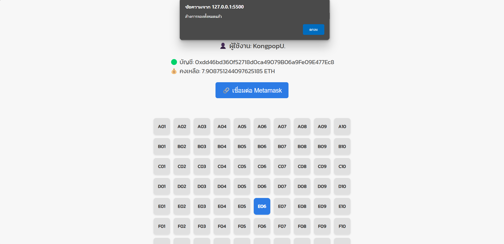

# 🎫 B-Booking

**B-Booking** คือระบบจองที่นั่งออนไลน์ที่ใช้งานง่ายและสะดวกสบาย โดยสามารถทำการเลือกจองและจัดการที่นั่งของคุณได้ทันที

## 👥 ทีมผู้พัฒนา

| รูปภาพ | ชื่อ |
| :---: | :--- |
|  | เชาวน์ปัญ ธนวัฒน์เสถียร |
|  | ก้องภพ อุสนทร |
|  | ก้องภพ หอมถวาร |

## 🔗 เว็บไซต์

ทดลองใช้งานได้ที่: [https://kongpopus.github.io/B-Booking/](https://kongpopus.github.io/B-Booking/)

## ✨ คุณสมบัติเด่น

- จองที่นั่งออนไลน์ได้อย่างรวดเร็วผ่านเว็บเบราว์เซอร์
- ระบบเข้าสู่ระบบสำหรับผู้ใช้งานเพื่อความปลอดภัย
- อินเทอร์เฟซที่ใช้งานง่าย เหมาะกับทุกกลุ่มผู้ใช้งาน
- ดูสถานะการจองและรายละเอียดได้แบบเรียลไทม์

## 🖥️ โครงสร้างหน้า Frontend

- **หน้าเข้าสู่ระบบ (Login Page)**  
  ผู้ใช้งานสามารถกรอกอีเมลและรหัสผ่านเพื่อล็อกอินเข้าสู่ระบบ
  
  
- **หน้าเลือกที่นั่ง (Seat Selection Page)**  
  แสดงแผนผังที่นั่ง สามารถเลือกและจองที่นั่งได้แบบอินเทอร์แอคทีฟ
  

- **หน้าดูการจองที่นั่ง (Booking Seat Page)**  
  แสดงการจองที่นั่งของผู้ใช้งาน
  

- **หน้าการทำธุรกรรม (Transaction)**  
  สำหรับผู้ใช้ เมื่อจะทำการจองและจัดการที่นั่ง
  

- **หน้าข้อความแจ้งเตือน (Notification Page)**  
  แจ้งเตือนสถานะการจองสำเร็จ, เตือนการยืนยัน หรือข้อความอื่น ๆ
  
  

## 🛠 เทคโนโลยีที่ใช้

- HTML5
- CSS3
- JavaScript
- Bootstrap
- jQuery
- Firebase
